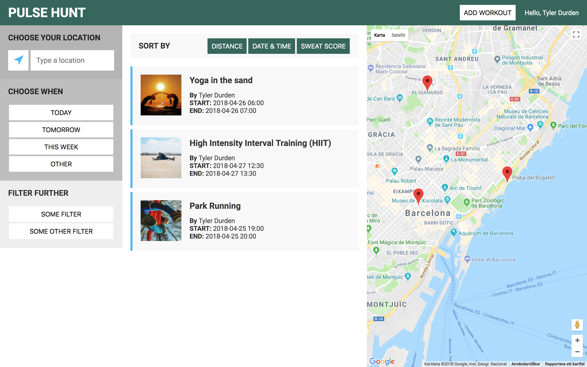
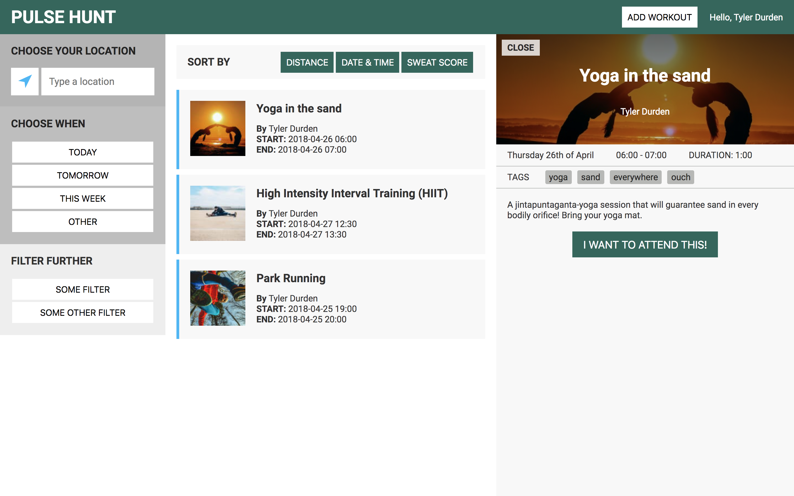
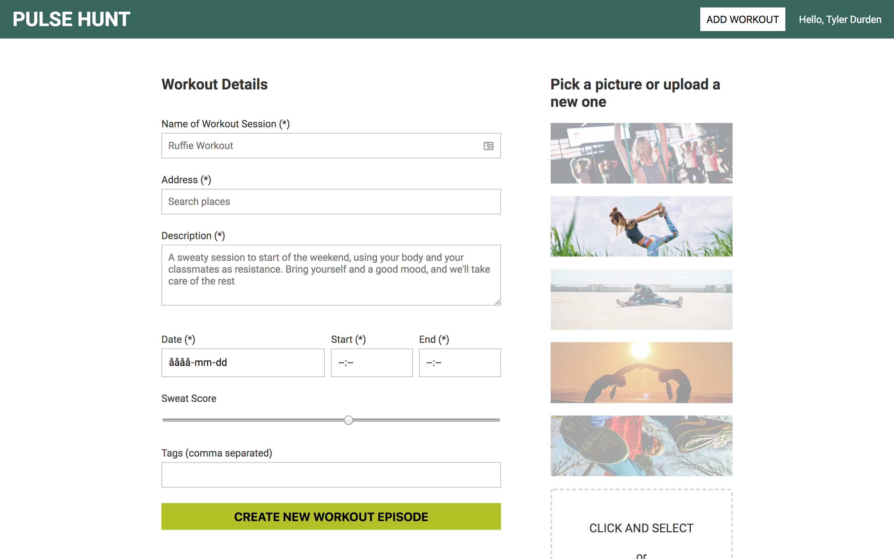

# Pulse Hunt (client/frontend)

Pulse Hunt is a market place where Indie Trainers can offer their workout sessions to users.

This is client/front-end. The back-end/server can be found [here](https://github.com/Tezenn/pulsehunt-backend).

## Getting started

### Prerequisites
* NPM
* The server running in background.

You can run the front-end alone, but none of the functionality will work.

### Installing
* Clone this repo: `git clone https://github.com/nikko89/pulsehunt-frontend`
* Move into the folder: `cd pulsehunt-frontend`
* Install all dependencies: `npm install`
* Start the development environment: `npm start` 

## Tech Stack
* [React](https://reactjs.org/)
* [Redux](https://redux.js.org/)

## Feedback
If you have any feedback, send me an [email](mailto:christofer.herlin@gmail.com) or open an issue on the repo.

## Collaboration
All improvements welcome! Open a pull request and let's discuss.
## Screenshots

